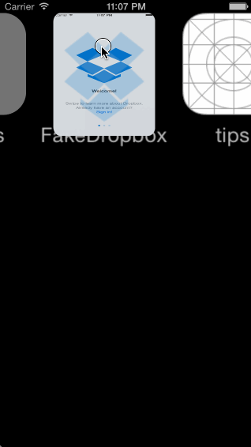

FakeDropbox
===========

This is an iOS prototype of the Dropbox app's basic signed out and signed in state. See the [Week 1 Project: Dropbox](http://courses.codepath.com/courses/ios_for_designers/week/1) assignment.

Time spent: 5 hours spent in total

Completed project requirements:

 * [x] Required: User can follow the create user flow
 * [x] Required: User can follow the sign in flow

Walkthrough of all user stories:

GIF created with [LiceCap](http://www.cockos.com/licecap/).
